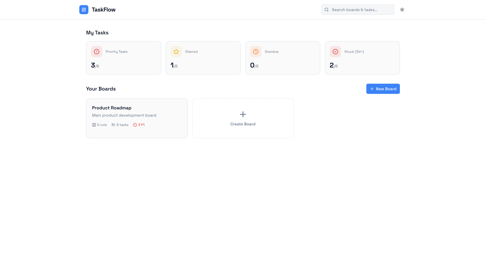
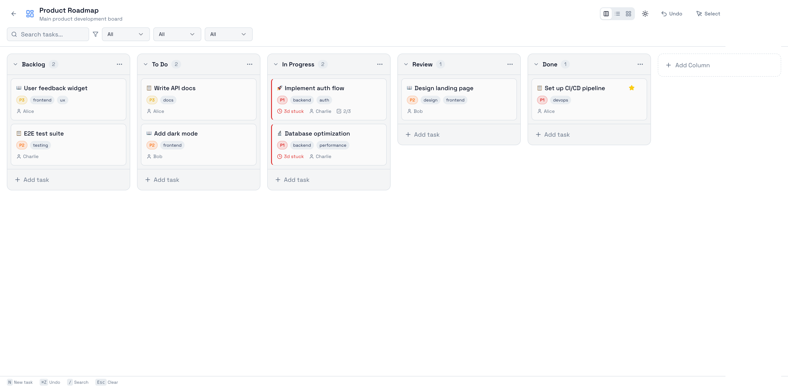
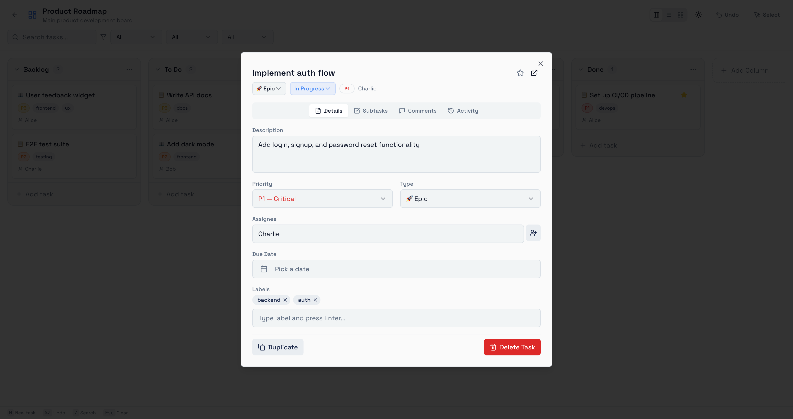
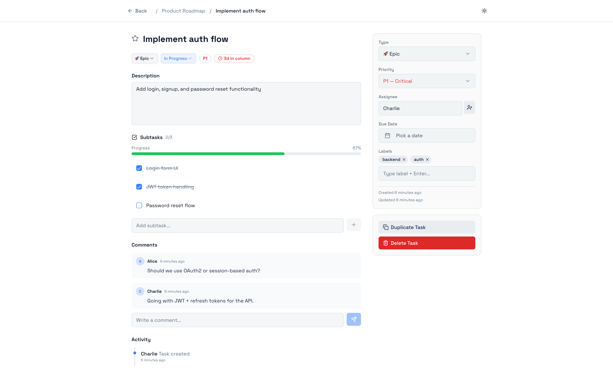

# 📋 TaskFlow - Modern Kanban Board Application

**TaskFlow** is a modern task management application that helps teams and individuals organize, prioritize, and track their work using an intuitive Kanban board interface. It combines the simplicity of visual task management with powerful filtering and organization capabilities.

## ✨ Key Features

- **Kanban Board View**: Visualize tasks across customizable columns
- **Multiple View Modes**: Board, List, and Grid view options
- **Advanced Filtering**: Search and filter tasks by priority, assignee, labels, and more
- **Task Management**: Create, edit, delete, and manage tasks with rich metadata
- **Priority System**: Three-tier priority levels (P1, P2, P3) for task prioritization
- **Task Types**: Support for multiple task types (Task, Story, Bug, Defect, Spike, Epic)
- **Subtasks & Comments**: Break down tasks into subtasks and collaborate via comments
- **Activity Tracking**: Comprehensive activity logs for all task changes
- **Starred Tasks**: Mark important tasks for quick access
- **WIP Limits**: Enforce work-in-progress limits on board columns
- **Recently Viewed**: Quick access to recently viewed boards
- **Dark Mode**: Full dark mode support with theme persistence
- **Responsive Design**: Mobile-friendly interface
- **Undo Functionality**: Revert recent changes to your board

---

## 🏗️ Architecture

### High-Level Architecture

```
┌─────────────────────────────────────────────────────────┐
│                    TaskFlow Application                 │
├─────────────────────────────────────────────────────────┤
│                                                         │
│  ┌──────────────┐      ┌──────────────┐                │
│  │  Pages       │      │  Components  │                │
│  ├──────────────┤      ├──────────────┤                │
│  │ • Index      │      │ • Kanban     │                │
│  │ • BoardPage  │      │ • UI         │                │
│  │ • TaskDetail │      │ • Navigation │                │
│  │ • NotFound   │      │ • Theme      │                │
│  └──────────────┘      └──────────────┘                │
│         ▲                      ▲                        │
│         └──────────┬───────────┘                        │
│                    │                                    │
│         ┌──────────▼──────────┐                        │
│         │  KanbanContext      │                        │
│         │  (State Management) │                        │
│         └──────────┬──────────┘                        │
│                    │                                    │
│  ┌─────────────────▼─────────────────┐                │
│  │  Local Storage Persistence        │                │
│  └───────────────────────────────────┘                │
│                                                         │
└─────────────────────────────────────────────────────────┘
```

### Project Structure

```
src/
├── pages/                      # Page components
│   ├── Index.tsx              # Home/Dashboard page with board overview
│   ├── BoardPage.tsx          # Main Kanban board page
│   ├── TaskDetailPage.tsx     # Individual task details view
│   └── NotFound.tsx           # 404 page
│
├── components/
│   ├── kanban/                # Kanban-specific components
│   │   ├── Column.tsx         # Board column component
│   │   ├── TaskCard.tsx       # Individual task card
│   │   ├── TaskModal.tsx      # Task creation/editing modal
│   │   ├── CreateBoardDialog.tsx  # New board creation
│   │   ├── Filters.tsx        # Advanced filtering UI
│   │   ├── BulkActions.tsx    # Batch task operations
│   │   └── EmptyState.tsx     # Empty board state UI
│   │
│   ├── ui/                    # Reusable UI components (shadcn/ui)
│   │   ├── button.tsx
│   │   ├── dialog.tsx
│   │   ├── input.tsx
│   │   ├── badge.tsx
│   │   ├── card.tsx
│   │   ├── toast.tsx
│   │   └── ... (30 components)
│   │
│   ├── NavLink.tsx            # Navigation link component
│   ├── ThemeToggle.tsx        # Dark mode toggle
│   └── useRecentlyViewed.tsx  # Recently viewed boards hook
│
├── context/
│   └── KanbanContext.tsx      # Global state management with useReducer
│
├── hooks/
│   ├── use-mobile.tsx         # Mobile detection hook
│   ├── use-toast.ts           # Toast notification hook
│   └── useRecentlyViewed.ts   # Recently viewed items hook
│
├── types/
│   └── kanban.ts              # TypeScript type definitions
│
├── lib/
│   └── utils.ts               # Utility functions (cn, etc.)
│
├── test/
│   ├── setup.ts               # Vitest setup
│   └── example.test.ts        # Example tests
│
├── App.tsx                    # Root app component with routing
├── main.tsx                   # Entry point
├── index.css                  # Global styles
└── App.css                    # App-specific styles
```

### Technology Stack

| Layer                  | Technology               | Purpose                |
| ---------------------- | ------------------------ | ---------------------- |
| **Frontend Framework** | React 18.3               | UI library             |
| **Language**           | TypeScript 5.8           | Type safety            |
| **Routing**            | React Router 6.30        | Client-side routing    |
| **State Management**   | useReducer (Context API) | Global state           |
| **UI Components**      | shadcn/ui (Radix UI)     | Component library      |
| **Styling**            | Tailwind CSS 3.4         | Utility-first CSS      |
| **Form Handling**      | React Hook Form 7.61     | Form management        |
| **Validation**         | Zod 3.25                 | Schema validation      |
| **Icons**              | Lucide React 0.462       | Icon library           |
| **Notifications**      | Sonner 1.7               | Toast notifications    |
| **Theme**              | next-themes 0.3          | Dark mode support      |
| **Date Utilities**     | date-fns 3.6             | Date manipulation      |
| **Build Tool**         | Vite 5.4                 | Fast build system      |
| **Testing**            | Vitest 3.2               | Unit testing framework |
| **Linting**            | ESLint 9.32              | Code quality           |

### Data Flow

```
User Action (Click, Input)
        ▼
Component Event Handler
        ▼
Dispatch to KanbanContext Reducer
        ▼
Update Global State
        ▼
Persist to Local Storage
        ▼
Component Re-renders with New State
        ▼
UI Updates (Optimistic)
```

---

## 🎯 State Decisions

### 1. **State Management: useReducer + Context API**

**Decision**: Use React's built-in `useReducer` with Context API for global state management instead of Redux or Zustand.

---

### 2. **Local Storage Persistence**

**Decision**: Use browser's Local Storage for data persistence instead of a backend database.

---

### 3. **Immutable State Updates**

**Decision**: Treat state as immutable and always return new objects/arrays from reducers.

---

### 4. **Derived State with useMemo**

**Decision**: Calculate derived state (stats, filters, sorting) using `useMemo` instead of storing in global state.

---

### 5. **View Mode Separation**

**Decision**: Keep view mode (board/list/grid) as local component state, not global state.

---

### 8. **Component Composition**

**Decision**: Separate concerns into focused components with clear responsibilities.

**Structure**:

- **Page Components**: Route-level components (Index, BoardPage)
- **Feature Components**: Kanban-specific logic (Column, TaskCard, Filters)
- **UI Components**: Reusable base components (Button, Dialog, Input)
- **Custom Hooks**: Shared logic (useKanban, useRecentlyViewed)

**Benefits**:

- ✅ Easy to test individual components
- ✅ Reusable across pages
- ✅ Clear responsibility boundaries
- ✅ Easier to maintain and debug

---

## 📸 Screenshots

### 1. **Home Page / Dashboard**

The landing page displays an overview of all boards, recent activity statistics, and quick access to recently viewed boards.



---

### 2. **Kanban Board View - Column Layout**

The main board view with tasks organized across customizable columns. Drag-and-drop functionality allows seamless task movement between statuses.



---

### 3. **Kanban Board View - List Layout**

Alternative list view for a more linear task visualization with detailed information in a tabular format.


---

### 4. **Kanban Board View - Grid Layout**

Grid view provides a card-based layout for visual task scanning with multiple columns visible at once.


---

### 5. **Task Detail Modal**

Quick-edit modal for modifying task properties without navigating away from the board. Includes priority, assignee, due date, labels, and more.



---

### 6. **Task Detail Page**

Full-page task view with comprehensive details including subtasks, comments, activity log, and all task metadata.



---

## 🚀 Getting Started

### Installation

```bash
npm install
```

### Development

```bash
npm run dev
```

Open [http://localhost:5173](http://localhost:5173) to view in the browser.

### Build

```bash
npm run build
```

### Testing

```bash
npm run test
npm run test:watch
```

### Linting

```bash
npm run lint
```

---

**Happy task managing with TaskFlow! 🚀**
